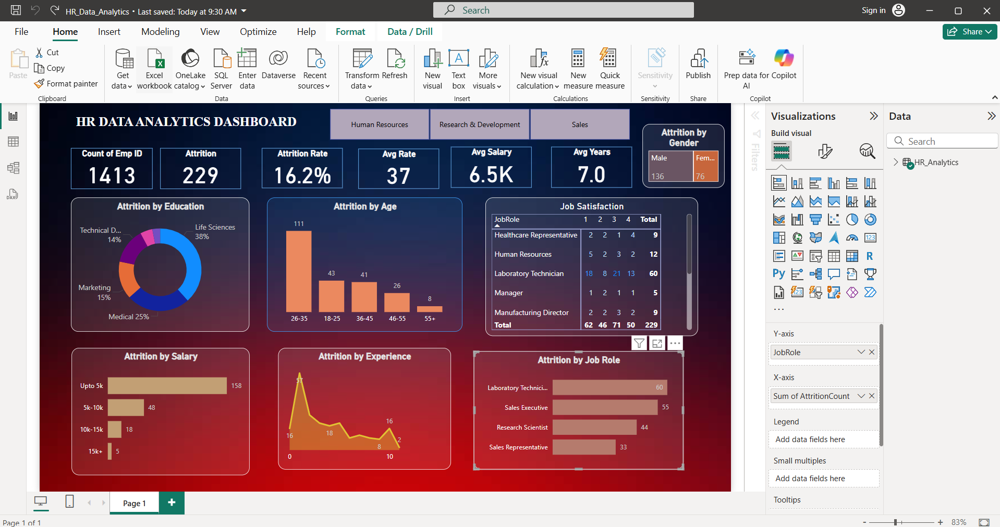

# HR-Data-Analytics Project

This repository contains files related to the HR Analytics dashboard created using Power BI.

## Project Overview

The HR Dashboard provides insights into employee data through interactive visualizations and reports. It helps HR teams track key metrics such as employee performance, attendance, and other analytics.

## Files Included

- `HR_Analytics.csv` – Raw HR data used for analysis.
- `HR_Data_Analytics.pbix` – Power BI dashboard file with reports and visuals.

## Screenshot

## How to Use

1. Open the `HR_Data_Analytics.pbix` file in Power BI Desktop to view and interact with the dashboard.
2. Use the `HR_Analytics.csv` file to update or refresh the data source.

